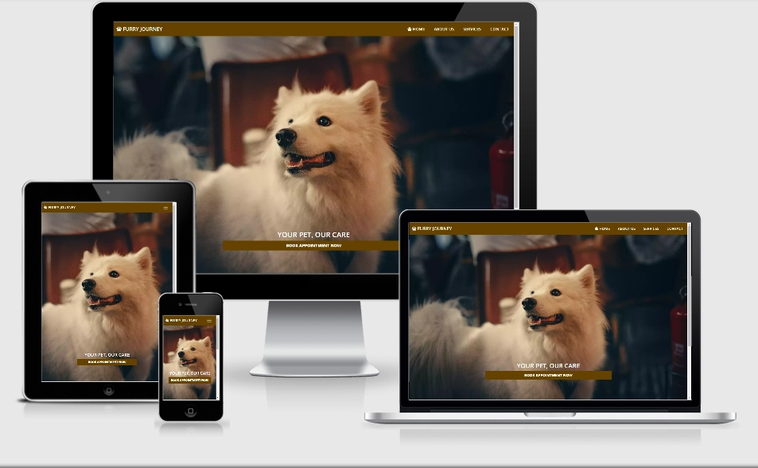

# Furry Journey



## About
Furry Journey is a fictional veterinary clinic where pet owners can view services and treatments available for their pets and book appointments in a quick and easy manner. Users can sign up for a newsletter to receive news about the clinic and learn more about new deals on services and treatments. The website's main goal is to help users look for their desired service and book appointments for their pet in just under two clicks.

## Table of contents

[UX (User Experience)](#UX)

[Features](#features)

[Technologies Used](#technologies)

[Testing](#testing)

[Deployment](#deployment)

[Known Bugs](#bugs)

[Credits](#credits)

<a name="UX"></a>
## UX (User Experience)

### Website's Goals

1. This will be business-to-consumer website with the main goal of getting users signed up to the veterinary clinic, build a bigger user base and to provide a consistent service with the hope of establishing the users trust.
1. The business target audience is any user with a pet that needs treatment from a vet.
1. The business wants to ensure that the website is easy to navigate and prevents potential users being overloaded with information on services and treatments.
1. The users will see short summaries of treatments that clinic provides.

### User Stories

As a first time visitor I want...
* The ability to navigate the site on mobile, tablet and desktop with an easy way to book appointments and source basic details about the clinic (E.g. opening hours) as soon as possible.
* To view services and treatments that the clinic can provide to my pet.
* To use the contact page and any social networks they may have so that staff can answer general queries.
* To sign up to a newsletter and stay up to date on new deals on services, treatments and also learn more about any changes to the clinic.

### Wireframes
#### Desktop Wireframe


#### Mobile Wireframe

<a href="assets/wireframes/tablet-wireframe.png" target="_blank">Tablet Wireframe</a>

<a name="features"></a>
## Features

Every page on the website has consistent navigation bar with brand name Furry Journey in left hand corner and a footer that contains a site map, opening times, and social media links that are responsive across all devices.

### Home 

The homepage has large hero image of white dog that takes up 100% of the viewport height and in the main section of the homepage is CTA button to book appointment which redirects to contact us page.

### About

The about page has small description about Furry Journey and their aim to give users pets the best pet care possible with an image of two yellow puppies. Further down the page we have the perks of why to choose Furry Journey then a form requiring email address and CTA button to sign up to Furry Journey's newsletter. 

### Services

The services page lists all the servicves that are available that users can request when booking appointment and they can use CTA button at the bottom of main section to book appointment quickly.

### Contact Us

The contact us page contains a form that requires the users to input all the fields before submission so that vets at Furry Journey have all essential information for getting in contact with the user and knows exactly what service the user wants from the form that was submitted.

### Newsletter Signed Up Confirmation

The newsletter signed up page thanks the user for signing up to the newsletter with image of two dogs sleeping.

### Appointment Booked

The appointment booked page thanks the user for booking appointment with Furry Journey and gives the user an option to sign up to the Furry Journey newsletter with a form that requires email address and CTA button for signing up.

<a name="technologies"></a>
## Technologies Used

### Languagues Used

- HTML
- CSS

### Frameworks and Programs Used

- [Visual Studio Code](https://code.visualstudio.com/) - The developer used Visual Studio Code for their IDE to build the website.
- [Bootstrap v5.0.0](https://getbootstrap.com/) - Bootstrap was used to make the website responsive across all devices.
- [Font Awesome v5.15.1](https://fontawesome.com/) - Font awesome was used to provide icons for the website.
- [Google Fonts](https://fonts.google.com/) - Google Fonts was was used to style text of the website.
- [Popper JS](https://popper.js.org/) - Popper JS was used with bootstrap to make site interactive.
- [Open Graph Protocol](https://ogp.me/) - Open Graph Protocol was used so that website could be shared on any social network or app that utilizes rich previews.
- [Adobe Photoshop](https://www.adobe.com/ie/products/photoshop.html) - Adobe Photoshop was used to resize the images for the website.
- [Google Cpweb Encoder](https://developers.google.com/speed/webp/docs/cwebp) - Google cpweb encoder was used to convert JPEG and PNG images to webp format to improve website performance.
- [Git](https://git-scm.com/) - Git was used in Visual Studio Code IDE for version control to commit and push to GitHub.
- [GitHub](https://github.com/) - GitHub was used to stored the website and website was deployed to GitHub pages to make website live.
- [Balsamiq](https://balsamiq.com/) - Balsamiq was used to create the wireframes for the website.

<a name="testing"></a>
## Testing

- [W3C Markup Validation Service](https://validator.w3.org/) - W3C Markup tool was to validate and ensure no syntax errors in HTML for website pages.
- [W3C CSS Validation Service](https://jigsaw.w3.org/css-validator/) - W3C CSS Validation tool was used to validate and ensure no syntax errors in the CSS stylesheet.
- [WebAIM Constrast Checker](https://webaim.org/resources/contrastchecker/) - WebAIM Constrast Checker tool was used to ensure contrast between foreground and background colors meets accessibility guidelines.
- [WAVE Web Accessibility Evaluation Tool](https://wave.webaim.org/) - This tool was used to ensure that web content on the website was more accessible to individuals with disabilities and meet accessibility guidelines.
- [Can I Use...](https://caniuse.com/) - It was used to check what techologies were supported in different web browser versions.

### Testing User Experience (UX)

- As first time visitor I want to understand what the site is about and find basic details about the veterinary clinic (E.g. opening hours) as soon as possible.
1. Entering the website the users can see navigation bar quiet clearly and its easy to read.
2. Users can quickly book appointment by using the book appointment button on homepage and can tell that Furry Journey provides veterinary services by their slogan "Your Pet, Our Care" and hero image of a dog.
3. Down at the bottom of the homepage in the footer users can see site map, opening times and social media platforms that they can follow Furry Journey on.

- As first time visitor I want to be able to navigate site easily to find service that I need.
1. Users can navigate the site across multipe devices without any issues and navigation bar helps them get around the website with ease.
2. In two pages the users have CTA for signing up to newsletter.
3. On the services page the user can see all services that are available for their pets and CTA for booking appointment.
4. On the about page the user gets short description about Furry Journey and grid telling them about perks of choosing Furry Journey.


### Further Testing

- The website was tested in Google Chrome, Mozilla Firefox, Opera, Microsoft Edge and Internet Explorer.
- The website was tested across a multipe device resolutions using Google Chrome developer tools and Mozilla Firefox developer tools.
- All page links were tested extenstively to ensure no links were broken.
- Family, Friends and work colleagues were asked to test and review the website to spot any issues from their devices and get their point of view of what they thought about the website.

<a name="deployment"></a>
## Deployment
This was project was developed in Visual Studio Code IDE and git was used within Visual Studio Code to commit and push to GitHub.

How to deploy this project to GitHub Pages from its GitHub repository following instructions beloiw,

1. Log in to GitHub and locate the [Furry Joureny GitHub Repository](https://github.com/adelliott92/furry-journey/)
2. Near top of the Repository, locate the option "Settings" with cog icon on the menu.
3. Scroll down the Settings page until you locate the "GitHub Pages" Section.
4. Under "Source", click the dropdown called "None" and select "Master Branch".
5. The page will automatically refresh.
6. Scroll back down through the Settings page to locate the now published site in the "GitHub Pages" section. ***WARNNG: It may take a few minutes for website to come live.***

### Forking the GitHub Repository

Forking the GitHub Repository will make a copy of the original repository on to your GitHub account to view and/or make changes without affecting the original repository by using the below instructions.

1. Log in to GitHub and locate the [Furry Joureny GitHub Repository](https://github.com/adelliott92/furry-journey)
2. Near top of the Repository just above the "Settings" Button on the menu, locate the "Fork" Button.
3. You should now have a copy of the original repository in your GitHub account.

### Making a Local Clone

1. Log in to GitHub and locate the [Furry Joureny GitHub Repository](https://github.com/YOUR-USERNAME/furry-journey)
2. Under the repository name, click "Clone or download".
3. To clone the repository using HTTPS, under "Clone with HTTPS", copy the link.
4. Open Git Bash
5. Change the current working directory to the location where you want the cloned directory to be made.
6. Type `git clone`, and then paste the URL you copied in Step 3.

```
$ git clone https://github.com/YOUR-USERNAME/furry-journey.git
```

7. Press Enter. Your local clone will be created.

```
$ git clone https://github.com/YOUR-USERNAME/furry-journey.git
> Cloning into `furry-journey`...
> remote: Enumerating objects: 300, done.
> remote: Counting objects: 100% (300/300), done.
> remote: Compressing objects: 100% (205/205), done.
> Receiving objects:  88% (264/300), 29.66 MiB | 2.09 MiB/sl 300 (delta 140), reused 238 (delta 81), pack-reused 0
> Receiving objects: 100% (300/300), 30.09 MiB | 2.11 MiB/s, done.
> Resolving deltas: 100% (140/140), done.
```

Click [Here](https://help.github.com/en/github/creating-cloning-and-archiving-repositories/cloning-a-repository#cloning-a-repository-to-github-desktop) to retrieve pictures for some of the buttons and more detailed explanations of the above process.

<a name="bugs"></a>
## Known Bugs

- Images are not loading in Internet Explorer this is because it does not support the image format webp.
- Bootstrap grids are not displaying correctly in Internet Explorer because most grid properties are either partially working or not supported [click here to read more.](https://caniuse.com/?search=grid)

<a name="credits"></a>
## Credits

### Code
- [Bootstrap v5.0.0](https://getbootstrap.com/) - Bootstrap was heavily used in this project for building the site and CSS grid on about.html and services.html

### Media
#### Unsplash Images
- index.html - landing page image "main-bg-dog.webp" - [Helena Lopes](https://unsplash.com/@wildlittlethingsphoto)

#### Pexels Images
- about.html - Two yellow puppies "two-blond-puppies.webp" - [Chevanon Photography](https://www.pexels.com/@chevanon)
- services.html - 3 Images "routine-checkup.webp", "specialist-services.webp", "diagnostics-laboratory-services.webp" - [Tima Miroshnichenko](https://www.pexels.com/@tima-miroshnichenko)
- services.html - 1 image "surgery.webp" - [Pranidchakan Boonrom](https://www.pexels.com/@pranidchakan-boonrom-101111)
- services.html - 1 image "euthansia.webp" - [Engin Akyurt](https://www.pexels.com/@enginakyurt)
- newsletter-signedup.html -  Dogs sleeps "newsletter-signedup-dogs.webp" - [Adrianna Calvo](https://www.pexels.com/@adriannaca)

### Acknowledgements

- My mentor Excellence Ilesanmi has been really helpful for providing me with useful insights and advice on creating my website. 
- Code Institute Tutor Support and Students in Slack all have been really helpful with tips for completeting my first milestone project.
